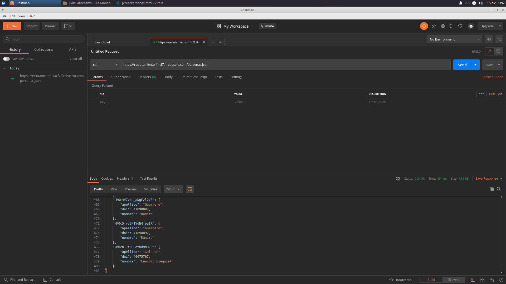
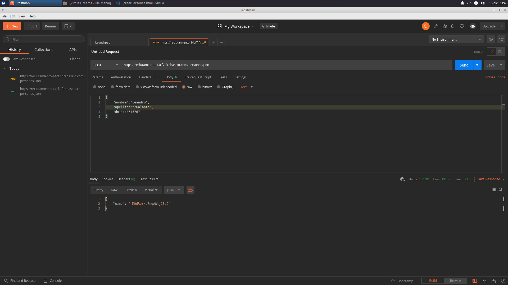
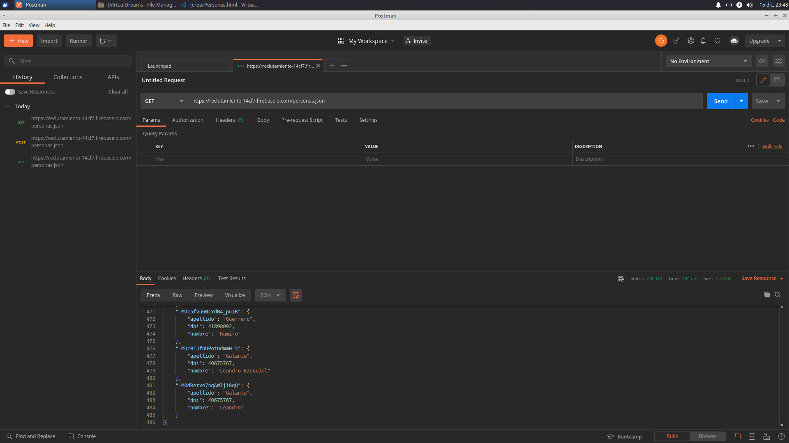

Ejercicio 2

    1. ¿Qué es un servidor HTTP?

	Un servidor HTTP se encarga de enviar peticiones desde el Cliente Web (normalmente un navegador o una aplicación cliente) hasta el sistema que se encarga de administrar las peticiones, luego se trasmite la respuesta correspondiente al cliente.

    2. ¿Qué son los verbos HTTP? Mencionar los más conocidos

	Son un conjunto de métodos de petición para indicar la acción que se desea realizar al comunicarse con el servidor.
	Los más conocidos son: GET, POST, PUT, DELETE. Luego se encuentran otros como HEAD, CONNECT, OPTIONS, TRACE, PATCH. 

    3. ¿Qué es un request y un response en una comunicación HTTP? ¿Qué son los headers?

	Un request o solicitud/petición, pide el acceso a toda la información que pasa desde el navegador del cliente al servidor.
	Un response o respuesta, es el mensaje que envía el servidor al cliente tras haber recibido una solicitud/petición. 
	Los headers o cabeceras permiten al cliente y al servidor enviar información adicional junto a una solicitud/petición o respuesta.

    4. ¿Qué es un queryString? (En el contexto de una url)

	Una QueryString es una cadena de caracteres que se utiliza para especificar valores de parámetros al momento de realizar una solicitud. Se crearon con el fin de realizar consultas a la base de datos y hacer las URLs más “amigables” por así decir, antes las URLs eran demasiado largas y con las QueryString todo se volvió mucho más sencillo y económico.

    5. ¿Qué es el responseCode? ¿Qué significado tiene los posibles valores devueltos?

	Los responseCode o Codigos de estado de respuesta, indican si se ha completado de forma satisfactoria una solicitud HTTP especifica. Estas respuestas se agrupan en 5 clases:

	Respuestas informativas (100 – 200)
	Respuestas satisfacorias (200 – 299)
	Redirecciones (300 – 399)
	Errores de los clientes (400 – 499)
	Errores de los servidores (500 – 599)

    6. ¿Cómo se envía data en un Get y cómo en un POST?

	En el método GET, el envío de datos se realiza mediante la URL, de esta forma, la información es visible y queda almacenada en el historial de búsqueda. En cambio, en el método POST, el envío de datos se realiza de forma que no podemos verlo (ocultos al usuario) y no queda guardada en el historial.

    7. ¿Qué verbo http utiliza el navegador cuando accedemos a una página?

	Al acceder a una página Web, utilizamos el GET para extraer del servidor la información necesaria.

    8. Explicar brevemente qué son las estructuras de datos JSON y XML dando ejemplo de estructuras posibles.

	Las estructuras de datos JSON (JavaScript Object Notation) y XML (Extensible Markup Language) son formatos de texto usados para el intercambio de información.

	Ejemplo JSON:
	{
		“persona”:	{
					“nombre”: “Leandro”,
					“apellido”: “Galante”,
					“dni”: “40675767”,
					}
	}

	Ejemplo XML:
	<persona>
		<nombre>Leandro</<nombre>
		<apellido>Galante</apellido>
		<dni>40675767</dni>
	</persona>

    9. Explicar brevemente el estándar SOAP

	SOAP (Simple Object Access Protocol) es un protocolo estándar basado en XML para la transmisión de mensajes en HTTP. Una de sus ventajas es que permite la comunicación entre distintos lenguajes de programación.

    10. Explicar brevemente el estándar REST Full

	REST (REpresentational State Transfer), es un modelo de arquitectura web basdo en el protocolo HTTP para mejorar las comunicaciones cliente-servidor. A todo servicio web que siga el estilo REST, se lo llama REST Full Web Service.

    11. ¿Qué son los headers en un request? ¿Para qué se utiliza el key Content-type en un header?

	Como puse anteriormente, los headers permiten al cliente y al servidor enviar información adicional junto a una solicitud/petición o respuesta. El Content-type en un header se utiliza para indicar el tipo de dato que se esta enviando.

	
	Ejercicio 3
	
	Primer GET
	

	POST
	

	Segundo GET
	

	En este ultimo GET se observa que se agregaron los datos ingresados en el POST
	(En caso de que no carguen las imagenes, dejo adjunto los screens en el repo)

	Ejercicio 4

	$ npm install //Instala las dependencias
	$ node mostrarPersonas.js

	Ejercicios 5 y 6

	$ node servidor.js //Levanta el servidor. Luego entrar al buscador mediante crearPersonas para cargar los datos de las mismas.
